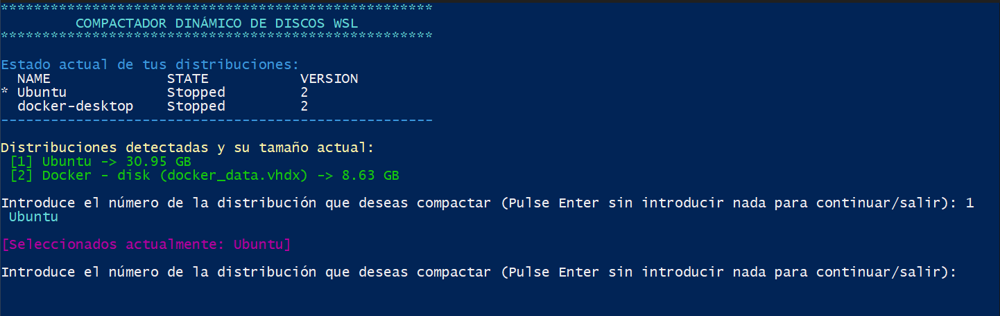

# WSL-DISK-SHRINKER

Automated PowerShell tool to scan and compact expanding **WSL2** and **Docker Desktop** VHDX virtual disks.

## Description

WSL2 and Docker Desktop use dynamic virtual hard disks (`.vhdx`) that grow over time but do not automatically shrink when you delete files. This script simplifies the process of reclaiming that wasted space by identifying and compacting these disks.

## Key Features

- **Auto-Elevation**: Automatically requests Administrator privileges to interact with `diskpart`.
- **Automatic Localization**: Detects your system language and displays menus in English or Spanish.
- **Smart Discovery**: Scans Windows Registry and Docker directories to locate all relevant `.vhdx` files (ignores small system files).
- **Multi-Selection**: Batch-process multiple distributions in one execution.
- **Safe Execution**: Prompts for a full WSL shutdown to ensure data integrity during compaction.

## How to use

1. Download or clone this repository.
2. Right-click `shrink-wsl.ps1` and select **Run with PowerShell**.
3. Follow the on-screen instructions to select the disks you want to compact.

## License

Distributed under the MIT License.
